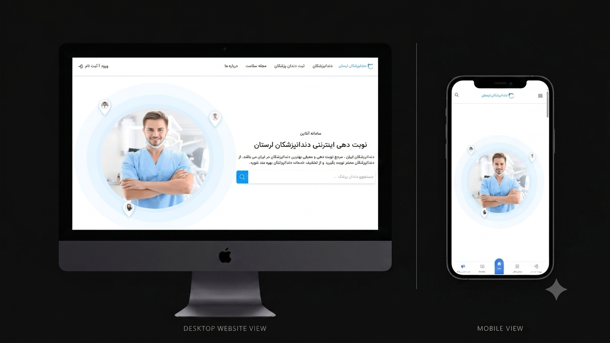

# 🦷 Appointment Reservation System

<p align="center">
  <h3 align="center">A Modern Dental Appointment Reservation Platform</h3>

  <p align="center">
    Built with React, Vite & JavaScript
  </p>

  <p align="center">
    
    
    
    
    
  </p>
</p>

---

## 📖 About The Project

**Appointment Reservation System** is a modern web application designed for managing dental appointments. The platform provides dedicated dashboards for **Patients**, **Dentists**, and **Administrators**, enabling seamless appointment scheduling, user management, and clinic operations.

The application focuses on delivering a responsive, user-friendly experience while following a modular React architecture.

---

# ✨ Features

## 👤 Authentication

* User Registration
* Secure Login
* OTP Verification
* Protected Routes
* Logout Functionality

---

## 🦷 Patient Features

* Browse Dentists
* View Dentist Profiles
* Reserve Appointments
* Manage Personal Appointments
* Edit Profile Information

---

## 👨‍⚕️ Dentist Features

* Dedicated Dentist Dashboard
* Manage Working Hours
* Appointment Management
* Service Management
* Profile Management

---

## 🛡️ Admin Features

* Admin Dashboard
* User Management
* Dentist Management
* Patient Management
* Articles Management
* Comments Management

---

## 🎨 UI Features

* Responsive Design
* Mobile Friendly
* Modern User Interface
* Component-Based Architecture
* Reusable Components

---

# 🛠 Tech Stack

| Technology        | Purpose              |
| ----------------- | -------------------- |
| React             | Frontend Library     |
| Vite              | Build Tool           |
| JavaScript (ES6+) | Programming Language |
| Tailwind CSS      | Styling              |
| React Router      | Routing              |
| Zustand           | State Management     |
| Axios / API       | Server Communication |

---

# 📂 Project Structure

```text
src
│
├── component
│   ├── dentist
│   ├── paneladmin
│   └── ...
│
├── pages
│   ├── adminpanel
│   ├── dentistpanel
│   ├── Userpanel
│   └── ...
│
├── hooks
├── stores
├── features
├── utils
├── routes.jsx
└── App.jsx
```

---

# 🚀 Getting Started

Clone the repository

```bash
git clone https://github.com/AlirezaRashnoo/Appointment_reservation.git
```

Install dependencies

```bash
npm install
```

Run the development server

```bash
npm run dev
```

Open

```text
http://localhost:5173
```

---

# 📸 Screenshots

<p align="center">
  
</p>


---

# 📌 Project Highlights

* Multi-role Authentication
* OTP Verification
* Protected Routing
* Admin Dashboard
* Dentist Dashboard
* Patient Dashboard
* Appointment Scheduling
* Modular Folder Structure
* Responsive Design

---

# 🔮 Future Improvements

* Online Payment Gateway
* Calendar Integration
* Email Notifications
* SMS Notifications
* Push Notifications
* Dark Mode
* Multi-language Support
* Search & Filtering
* Appointment Reminder
* Video Consultation

---

# 🤝 Contributing

Contributions, issues, and feature requests are welcome.

Feel free to Fork this repository and submit a Pull Request.

---

# 👨‍💻 Author

**Alireza Rashnoo**

GitHub

https://github.com/AlirezaRashnoo

---

# ⭐ Support

If you like this project, please give it a ⭐ on GitHub.

It helps others discover the project and motivates future improvements.

---

<p align="center">
Made with ❤️ using React + Vite
</p>
